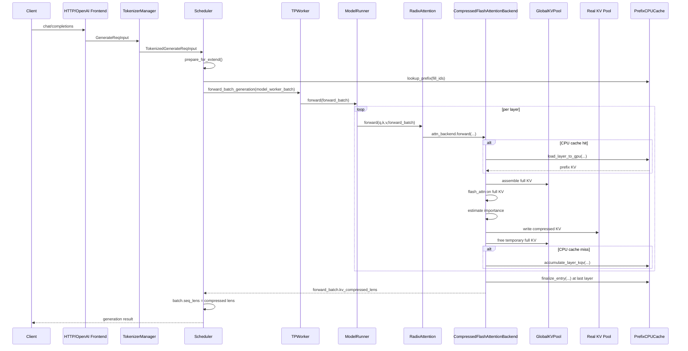

# Compressed FA3 调用链与工作机制

本文档梳理 `compressed_fa3` 从前端请求进入到 runtime 执行的完整链路，并重点解释三件事：

1. `compressed_total_lens` 如何影响 KV 内存分配
2. CPU prefix cache 的 hit/miss 两条分支
3. decode 阶段如何消费压缩后的 KV cache

---

## 1. 功能概述

`compressed_fa3` 对应的实现类是：

- `python/sglang/srt/layers/attention/compressed_flashattention_backend.py`
- 类：`CompressedFlashAttentionBackend`

它的核心思想不是“直接在压缩 KV 上做 prefill attention”，而是：

1. 先组装完整 KV
2. 用完整 KV 做 FlashAttention，得到当前层正确输出
3. 再根据重要性选择要保留的 KV
4. 只把压缩后的 KV 留在真实 KV cache 里给后续 decode 用

因此它的设计目标是：

```text
当前 prefill 输出不损失质量
后续 decode 只占用压缩后的 KV 显存
```

同时，这个 backend 还叠加了：

1. `GlobalKVPool / RealKVPool` 双池设计
2. CPU prefix cache 命中复用
3. prefix miss 时把 full KV / Q 存回 CPU

---

## 2. 启用入口

### 2.1 CLI 参数

用户通过以下参数启用：

```bash
python -m sglang.launch_server \
  --attention-backend compressed_fa3 \
  --kv-compression-ratio 0.5
```

相关参数定义：

- `python/sglang/srt/server_args.py:122-145`
- `python/sglang/srt/server_args.py:3244-3262`

其中：

- `--attention-backend compressed_fa3` 选择 backend
- `--kv-compression-ratio` 控制压缩率
- `--kv-compression-window-size` 控制最近 token 保留窗口
- `--kv-compression-min-tokens` 控制最少保留 token 数

注意当前实现中：

```text
compression_ratio = 0.5
=> 保留约 50% token
=> 压缩掉约 50% token
```

---

## 3. 前端到 Runtime 总链路

## 3.1 启动链路

入口：

- `python/sglang/launch_server.py:31-35`

启动流程：

```text
launch_server.py
  -> prepare_server_args(...)
  -> http_server.launch_server(server_args)
```

对应位置：

- `python/sglang/launch_server.py:7, 24-28`
- `python/sglang/srt/entrypoints/http_server.py`

---

## 3.2 请求进入链路

HTTP/OpenAI 请求进入后，前端会把请求转成内部结构：

```text
FastAPI/OpenAI request
  -> GenerateReqInput
  -> TokenizerManager.generate_request(...)
  -> TokenizedGenerateReqInput
  -> Scheduler
```

关键位置：

- `python/sglang/srt/entrypoints/openai/serving_chat.py`
- `python/sglang/srt/entrypoints/openai/serving_completions.py`
- `python/sglang/srt/managers/tokenizer_manager.py:490, 906-925`
- `python/sglang/srt/managers/scheduler.py:1033-1086`

---

## 3.3 调度与执行链路

调度主循环：

- `python/sglang/srt/managers/scheduler.py:1105-1129`

主流程：

```text
recv_requests()
  -> process_input_requests(...)
  -> get_next_batch_to_run()
  -> run_batch(batch)
```

批执行关键链路：

```text
Scheduler.run_batch
  -> TPWorker.forward_batch_generation
  -> ForwardBatch.init_new
  -> ModelRunner.forward
  -> RadixAttention.forward (per layer)
  -> forward_batch.attn_backend.forward(...)
```

关键位置：

- `python/sglang/srt/managers/scheduler.py:2281-2409`
- `python/sglang/srt/managers/tp_worker.py:441-523`
- `python/sglang/srt/model_executor/forward_batch_info.py`
- `python/sglang/srt/layers/radix_attention.py:99-135`

---

## 4. Backend 初始化链路

`ModelRunner` 初始化 attention backend：

- `python/sglang/srt/model_executor/model_runner.py:1725-1798`

流程：

```text
ModelRunner.init_attention_backend()
  -> _get_attention_backend()
  -> _get_attention_backend_from_str("compressed_fa3")
  -> ATTENTION_BACKENDS["compressed_fa3"](runner)
```

registry 注册位置：

- `python/sglang/srt/layers/attention/attention_registry.py:12-18`
- `python/sglang/srt/layers/attention/attention_registry.py:180-194`

即：

```python
@register_attention_backend("compressed_fa3")
def create_compressed_flashattention_backend(runner):
    return CompressedFlashAttentionBackend(runner)
```

最终：

```text
forward_batch.attn_backend = CompressedFlashAttentionBackend(...)
```

---

## 5. 时序图



---

## 6. Extend / Prefill 阶段核心流程

入口：

- `python/sglang/srt/layers/attention/compressed_flashattention_backend.py:203-241`

当 `save_kv_cache=True` 时，extend 默认进入：

- `python/sglang/srt/layers/attention/compressed_flashattention_backend.py:224-225`

即：

```python
return self._forward_extend_global_real_split(...)
```

这个函数的逻辑可以拆成三段。

### 6.1 Phase 1: 组装 Full KV

对应代码：

- `compressed_flashattention_backend.py:352-448`

对 batch 中每个 request：

1. 计算 `full_seq_len = prefix_len + extend_len`
2. 从 `GlobalKVPool` 分配临时 full KV 空间
3. 如果 CPU prefix hit，则从 CPU prefix cache 加载 prefix KV 到 GPU
4. 把本次 extend 产生的新 K/V 也写进 full KV
5. 得到 `k_full, v_full`

此时 `GlobalKVPool` 里保存的是：

```text
当前层、当前请求的完整上下文 KV
```

### 6.2 Phase 2: 用 Full KV 跑 FlashAttention

对应代码：

- `compressed_flashattention_backend.py:450-475`

做法：

1. 拼接 batch 内所有序列的 `k_full/v_full`
2. 调 `flash_attn_varlen_func(...)`
3. 直接返回 full attention 的 output

这一阶段决定了一个关键性质：

```text
当前 prefill 输出来自完整 KV，而不是压缩后的 KV
```

所以本轮 prefill 不因为压缩丢质量。

### 6.3 Phase 3: 压缩并写入 Real KV Pool

对应代码：

- `compressed_flashattention_backend.py:480-639`

对每个 request：

1. 构造 `q_for_compress`
2. 调 `_estimate_importance(...)`
3. 得到 `keep_indices`
4. 决定 `num_to_keep`
5. 把保留的 KV 写入 `real_slots`
6. 释放 `GlobalKVPool` 的临时 full KV

因此：

```text
GlobalKVPool: 短生命周期，存 full KV
Real KV Pool: 长生命周期，存 compressed KV
```

---

## 7. compressed_total_lens 如何影响内存分配

这是整个设计最重要的 runtime 变化之一。

### 7.1 调度阶段预计算压缩后总长度

代码：

- `python/sglang/srt/managers/schedule_batch.py:1543-1578`

逻辑：

```python
full_len = prefix_len + extend_len

if full_len <= min_tokens or full_len <= window_size:
    compressed_total_len = full_len
else:
    compressed_total_len = max(min_tokens, int(full_len * (1 - ratio)))
```

结果写入：

```python
self.compressed_total_lens_cpu
self.compressed_total_num_tokens
```

这一步意味着：

```text
调度器在真正 forward 前，就已经知道每个 request 的目标压缩后长度
```

### 7.2 alloc_for_extend 按压缩后长度分配真实 KV slots

代码：

- `python/sglang/srt/mem_cache/common.py:394-434`

如果 `use_compressed_len=True`：

1. 不按 `extend_num_tokens` 分配
2. 而是按 `compressed_total_num_tokens` 分配
3. 并且写入 `req_to_token_pool` 的也是压缩后视图

所以此时 real KV pool 的空间语义变成：

```text
“最终保留的压缩后 KV 的目标空间”
```

不是传统 FA3 里的：

```text
“先存全部 extend token，再压缩释放多余空间”
```

### 7.3 Global/Real split 如何配合

因为 real KV pool 只分了压缩后长度，完整 KV 没地方长期存，所以需要：

```text
GlobalKVPool 临时存 full KV
RealKVPool 永久存 compressed KV
```

这就是 `compressed_fa3` 当前实现里 `global_real_split` 方案存在的原因。

---

## 8. CPU Prefix Cache 的 hit / miss 分支

CPU prefix cache 逻辑分成两段：

1. 调度阶段判断命中
2. backend 执行阶段决定加载还是保存

### 8.1 命中判断：prepare_for_extend

代码：

- `python/sglang/srt/managers/schedule_batch.py:1464-1498`

逻辑：

```python
_hit = _cpu_cache.lookup_prefix(req.fill_ids)
```

如果命中：

```python
req.cpu_prefix_entry = entry
req.cpu_match_len = match_len
req.prefix_indices = dummy or real slots
req.set_extend_input_len(full_len - match_len)
```

如果未命中：

```text
请求按普通 prefill 流程执行
后续会把 full KV 存到 CPU
```

### 8.2 hit 分支：从 CPU 加载 prefix KV / Q

在 backend 中：

- Layer 0 初始化时记录命中与 miss 集合：`291-326`
- Phase 1 加载 prefix KV：`397-406`
- 压缩时若 query 太短，补加载 CPU 中缓存的 Q：`494-515`

hit 分支的本质是：

```text
prefix 对应的 full KV 不再重新 prefill 计算
而是从 CPU prefix cache 回搬到 GPU
```

然后再和新的 extend token 拼起来形成 full KV。

### 8.3 miss 分支：把本次 full KV / Q 存回 CPU

在 backend 中：

- `compressed_flashattention_backend.py:424-448`

当前层会调用：

```python
self.cpu_prefix_cache.accumulate_layer_kqv(req_id, layer_id, k_full, v_full, q_seq_agg)
```

最后一层结束后：

- `compressed_flashattention_backend.py:591-607`

调用：

```python
self.cpu_prefix_cache.finalize_entry(req_id, toks)
```

这表示：

```text
第一次请求：完整 prefill + 保存 CPU prefix entry
第二次相同 prefix 请求：直接 CPU hit + 回搬 KV
```

---

## 9. Decode 阶段如何使用压缩后的 KV

这部分容易混淆。

### 9.1 backend 在 prefill 末尾回写 compressed lens

代码：

- `compressed_flashattention_backend.py:614-617`

写入：

```python
forward_batch.kv_compressed_lens = [n + 1 if n is not None else None ...]
```

这里 `+1` 是当前实现的内部长度约定，调度层会据此更新 batch 视图。

### 9.2 scheduler 用 compressed lens 覆盖 seq_lens

代码：

- `python/sglang/srt/managers/scheduler.py:2402-2409`

逻辑：

```python
batch.seq_lens = kv_compressed_lens
batch.seq_lens_cpu = kv_compressed_lens
batch.seq_lens_sum = ...
```

所以在 prefill 完成后，scheduler 眼中的序列长度已经不是：

```text
full prefix + extend
```

而是：

```text
compressed KV length
```

### 9.3 decode 后续直接基于压缩后的映射执行

因为 `req_to_token_pool` 在 layer 0 就已经写入了 compressed real slots：

- `compressed_flashattention_backend.py:546-563`

后续 decode 时，attention backend 读取到的历史 KV 就是：

```text
被 keep_indices 选出来的压缩后 token 集合
```

也就是说 decode 阶段并不会再接触 prefill 时的 full KV。

decode 真正依赖的是：

1. `batch.seq_lens` 已更新为 compressed 长度
2. `req_to_token_pool` 已映射到 compressed real slots
3. real KV pool 中只保留压缩后的 K/V

所以 decode 的运行语义是：

```text
在压缩后的上下文状态上继续自回归生成
```

---

## 10. 与普通 `fa3` 的主要区别

普通 `fa3`：

```text
prefill 产生完整 KV
完整 KV 全部进入真实 KV cache
decode 消费完整 KV
```

`compressed_fa3`：

```text
prefill 用完整 KV 算输出
完整 KV 临时存在 GlobalKVPool
真实 KV cache 只保留压缩后的 KV
decode 消费压缩后的 KV
```

如果再加上 CPU prefix cache：

```text
首次请求：prefill + CPU 保存 full KV
重复前缀请求：CPU -> GPU 加载 prefix KV，再做压缩
```

---

## 11. 关键文件索引

### 配置与注册

- `python/sglang/srt/server_args.py`
- `python/sglang/srt/layers/attention/attention_registry.py`

### 请求入口

- `python/sglang/launch_server.py`
- `python/sglang/srt/entrypoints/http_server.py`
- `python/sglang/srt/entrypoints/openai/serving_chat.py`
- `python/sglang/srt/entrypoints/openai/serving_completions.py`

### 调度与 batch 构造

- `python/sglang/srt/managers/tokenizer_manager.py`
- `python/sglang/srt/managers/scheduler.py`
- `python/sglang/srt/managers/schedule_batch.py`
- `python/sglang/srt/mem_cache/common.py`
- `python/sglang/srt/model_executor/forward_batch_info.py`

### 执行路径

- `python/sglang/srt/managers/tp_worker.py`
- `python/sglang/srt/model_executor/model_runner.py`
- `python/sglang/srt/layers/radix_attention.py`
- `python/sglang/srt/layers/attention/compressed_flashattention_backend.py`

---

## 12. 一句话总结

`compressed_fa3` 的 runtime 机制可以概括为：

```text
用 full KV 算正确 prefill 输出，用 compressed KV 保存运行时状态，
再通过 GlobalKVPool/RealKVPool 和 CPU prefix cache 把长上下文的显存与重复前缀开销压下来。
```
